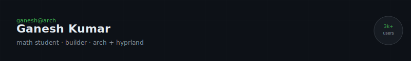

---

**building**  
[Study Friend](https://studyfriend.me) - AI edtech, 3k users  
Kitly - student workspace

**research**  
[Vector-Space & Probabilistic Ranking](https://github.com/ganeshspeaks/vector-space-probabilistic-ranking)  

**open source**  
[Tark](https://github.com/bitcraftproduction/tark) - Hindi programming language  
[BitMarkdown](https://github.com/bitcraftproduction/bit_markdown) - Flutter Markdown + LaTeX  

---

`available` for MVP builds · AI integrations · ML mobile apps &nbsp;·&nbsp; [Portfolio](https://ganeshspeaks.vercel.app) &nbsp;·&nbsp; [Email](mailto:ganesh@bitcraftproduction.com)
